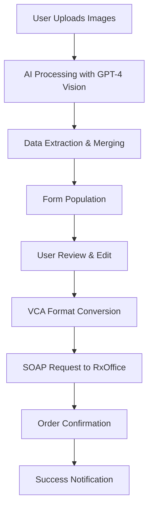

# 📋 RxOffice Image Extractor - Complete Documentation

A comprehensive AI-powered prescription processing application that extracts order data from prescription images and integrates with RxOffice EDI systems via SOAP.

## 📖 Table of Contents

1. [Overview](#overview)
2. [Features](#features)
3. [Architecture](#architecture)
4. [Setup & Installation](#setup--installation)
5. [User Guide](#user-guide)
6. [API Reference](#api-reference)
7. [Technical Specifications](#technical-specifications)
8. [Configuration](#configuration)
9. [Troubleshooting](#troubleshooting)
10. [Development](#development)

## 🌟 Overview

The RxOffice Image Extractor is a modern web application that revolutionizes prescription order processing by combining AI-powered image analysis with seamless RxOffice EDI integration. Users can upload prescription images, have the AI extract order data automatically, review and edit the information, and submit orders directly to RxOffice systems.

### Key Benefits

- **🤖 AI-Powered Extraction**: Uses GPT-4 Vision to automatically extract prescription data
- **📸 Multiple Image Support**: Process up to 5 images simultaneously for complete coverage
- **✏️ Editable Interface**: Comprehensive form with all VCA fields for manual adjustment
- **🔗 Real-time Integration**: Direct SOAP integration with RxOffice EDI systems
- **🎯 Professional UI**: Modern, responsive interface with intuitive workflow
- **🔐 Secure Authentication**: User-configurable RxOffice credentials

## ✨ Features

### Core Functionality

#### 🖼️ **Image Processing**
- **Multiple Format Support**: JPG, PNG, PDF files
- **Batch Processing**: Upload up to 5 images at once
- **AI Analysis**: GPT-4 Vision extracts prescription data
- **Smart Merging**: Combines data from multiple images intelligently
- **Preview Gallery**: Visual preview of all uploaded images

#### 📝 **Data Extraction & Editing**
- **Comprehensive Form**: All VCA fields organized in logical sections
- **Auto-population**: AI fills in detected prescription values
- **Manual Override**: Full editing capability for all fields
- **Validation**: Real-time validation with error messages
- **Customer Matching**: Intelligent customer name matching system

#### 🔗 **RxOffice Integration**
- **SOAP Protocol**: Direct integration with RxOffice EDI systems
- **VCA Format**: Full Vision Council of America format support
- **Authentication**: Secure credential management
- **Order Tracking**: Real-time order status and confirmation
- **Error Handling**: Comprehensive error reporting and recovery

#### 🎨 **User Interface**
- **Modern Design**: Clean, professional interface with gradients
- **Responsive Layout**: Works on desktop, tablet, and mobile
- **Progress Indicators**: Clear feedback during processing
- **Toast Notifications**: Real-time status updates
- **Accessibility**: Keyboard navigation and screen reader support

## 🏗️ Architecture

### Technology Stack

#### Frontend
- **Framework**: Next.js 14 with App Router
- **Language**: TypeScript
- **Styling**: Tailwind CSS
- **UI Components**: Shadcn/UI
- **Icons**: Lucide React
- **Notifications**: Sonner (toast notifications)

#### Backend APIs
- **Image Processing**: OpenAI GPT-4 Vision API
- **SOAP Integration**: Node.js SOAP client
- **File Handling**: Next.js FormData processing
- **Validation**: Zod schema validation

#### RxOffice EDI Service
- **Framework**: C# .NET 8 WCF
- **Protocol**: SOAP/XML
- **Database**: Entity Framework with in-memory/SQL Server
- **Authentication**: Custom authentication service
- **VCA Processing**: Custom VCA parser and validator

### Application Flow



### Component Structure

```
app/
├── page.tsx                    # Main application page
├── api/
│   ├── extract-order/         # Image processing API
│   └── create-order-soap/     # SOAP integration API
components/
├── ui/                        # Shadcn UI components
├── image-extractor-form.tsx   # Main order form
└── debug-modal.tsx           # Debug information modal
lib/
├── vca-converter.ts          # VCA format utilities
└── utils.ts                  # General utilities
```

## 🚀 Setup & Installation

### Prerequisites

- **Node.js**: v18.0.0 or higher
- **npm** or **yarn**: Latest version
- **OpenAI API Key**: For GPT-4 Vision processing
- **.NET 8**: For RxOffice EDI service
- **Git**: For repository management

### Quick Start

1. **Clone Repository**
```bash
git clone <repository-url>
cd whatsapp-order-extractor
```

2. **Install Dependencies**
```bash
npm install
```

3. **Environment Setup**
```bash
cp .env.example .env.local
```

4. **Configure Environment Variables**
```env
# OpenAI Configuration
OPENAI_API_KEY=your_openai_api_key_here

# RxOffice EDI Configuration
RXOFFICE_WSDL_URL=http://127.0.0.1:5000/CommonEDIService.svc?wsdl
RXOFFICE_USERNAME=380
RXOFFICE_PASSWORD=ZOHO123

# Application Configuration
USE_REAL_SOAP_SERVICE=true
NEXT_PUBLIC_APP_URL=http://localhost:3000
```

5. **Start Services**

**Terminal 1 - Next.js App:**
```bash
npm run dev
```

**Terminal 2 - RxOffice EDI Service:**
```bash
cd rxoffice-edi-service
./run.sh    # macOS/Linux
# or
run.bat     # Windows
```

6. **Verify Setup**
- App: http://localhost:3000
- SOAP Service: http://localhost:5000/health

## 📱 User Guide

### Getting Started

#### Step 1: Upload Images
1. Click "Select Prescription Images" or drag and drop files
2. Choose up to 5 images (JPG, PNG, PDF)
3. Images appear in the gallery with preview thumbnails
4. Use "Add More" to add additional images
5. Remove individual images by hovering and clicking X

#### Step 2: Process Images
1. Click "Extract Data from X Images"
2. AI processes all images simultaneously
3. Progress indicator shows processing status
4. Success notification confirms completion

#### Step 3: Review & Edit Data
1. **RxOffice Credentials**: Enter your username and password
2. **Basic Order Information**: Review order ID, customer name, etc.
3. **Prescription Data**: Verify sphere, cylinder, axis values
4. **Frame & Measurements**: Check IPD, frame dimensions
5. **Lens Options**: Select lens codes, coatings, tints
6. **Advanced Parameters**: Technical specifications

#### Step 4: Submit Order
1. Click "Submit Order"
2. System validates all required fields
3. Order converts to VCA format
4. SOAP request sent to RxOffice
5. Confirmation notification with order ID

### Form Sections Explained

#### 🔐 RxOffice EDI Credentials
- **Username**: Your RxOffice account username
- **Password**: Your RxOffice account password
- **Purpose**: Authentication for SOAP service calls

#### 📋 Basic Order Information
- **Eyes**: B (Both), R (Right), L (Left)
- **Order ID**: Unique identifier (auto-generated available)
- **Wearer's Name**: Customer full name
- **Name Abbreviation**: Customer initials
- **Shop Numbers**: ERP system references

#### 💊 Prescription Data
- **Sphere (SPH)**: Lens power in diopters (R;L format)
- **Cylinder (CYL)**: Astigmatism correction (R;L format)
- **Axis**: Cylinder axis in degrees (R;L format)
- **Add Power**: Progressive lens addition (R;L format)
- **Prism**: Prism correction values

#### 👓 Frame & Measurements
- **IPD**: Interpupillary distance
- **Frame Dimensions**: Width, height, bridge measurements
- **Segment Height**: For progressive lenses
- **Back Vertex Distance**: Distance from eye to lens

#### 🔬 Lens & Coating Options
- **Lens Code**: Specific lens product codes
- **Tint**: Lens tinting specifications
- **Coating**: Anti-reflective and other coatings
- **Color**: Lens color specifications

#### ⚙️ Advanced Parameters
- **Decentration**: Horizontal and vertical adjustments
- **Thickness**: Minimum thickness specifications
- **Tilt**: Pantoscopic and face form adjustments

### Tips for Best Results

#### Image Quality
- **High Resolution**: Use clear, high-resolution images
- **Good Lighting**: Ensure prescription is well-lit
- **Complete Coverage**: Include all prescription information
- **Multiple Angles**: Upload different views if needed
- **Readable Text**: Ensure all text is legible

#### Data Review
- **Verify Numbers**: Double-check all numerical values
- **Check Format**: Ensure R;L format for bilateral values
- **Required Fields**: Fill in Order ID and Customer Name
- **Credentials**: Verify RxOffice username/password

## 🔌 API Reference

### Frontend APIs

#### POST /api/extract-order
Processes uploaded images and extracts prescription data.

**Request:**
```typescript
FormData {
  images: File[]  // Array of image files
}
```

**Response:**
```typescript
{
  success: boolean
  data: VCAOrderData
  metadata: {
    imagesProcessed: number
    fileNames: string[]
  }
}
```

#### POST /api/create-order-soap
Submits order to RxOffice EDI via SOAP.

**Request:**
```typescript
{
  orderData: VCAOrderData
  credentials: {
    userName: string
    password: string
  }
}
```

**Response:**
```typescript
{
  success: boolean
  data: string | object  // Order ID or order object
  message: string
  vca: string           // Generated VCA string
}
```

### RxOffice EDI Service APIs

#### CreateOrder
Creates a new prescription order.

**Parameters:**
- `userName: string` - Authentication username
- `pwd: string` - Authentication password
- `vca: string` - VCA format order data

**Response:**
```xml
<CreateOrderResult>
  <Status>0</Status>
  <Message>Order created successfully</Message>
  <Data>
    <Id>12345</Id>
    <Reference>ORDER123</Reference>
  </Data>
</CreateOrderResult>
```

#### Other Operations
- `CancelOrder` - Cancel existing orders
- `GetOrderInfos` - Retrieve order history
- `GetOrderStatus` - Check order status
- `GetLensProducts` - Product catalog
- `GetCoatingProducts` - Coating options
- `GetTintingProducts` - Tinting options
- `GetDesigns` - Lens designs
- `GetStatuses` - Status definitions

## 🔧 Technical Specifications

### VCA Format Support

The application fully supports the Vision Council of America (VCA) format for prescription data exchange.

#### VCA String Structure
```
DO=B;JOB=ORDER123;CLIENT=John Doe;SPH=-1.75;-1.75;CYL=-0.50;-0.50;AXIS=90;90;ADD=2.00;2.00;IPD=64
```

#### Field Definitions

| Field | Description | Format | Required |
|-------|-------------|--------|----------|
| `DO` | Delivery Option | B/U/F/S | Yes |
| `JOB` | Order Reference | String | Yes |
| `CLIENT` | Customer Name | String | Yes |
| `SPH` | Sphere Power | R;L | No |
| `CYL` | Cylinder Power | R;L | No |
| `AXIS` | Axis | R;L | No |
| `ADD` | Addition Power | R;L | No |
| `IPD` | Pupillary Distance | Single/R;L | No |

#### Validation Rules
- Required fields: `DO`, `JOB`, `CLIENT`
- Bilateral format: Right;Left (e.g., "-1.75;-1.75")
- Numeric ranges: SPH (-20 to +20), CYL (-6 to +6)
- Axis range: 0-180 degrees
- IPD range: 20-80mm

### Image Processing

#### Supported Formats
- **JPEG/JPG**: Standard image format
- **PNG**: Lossless image format
- **PDF**: Document format (first page processed)

#### Processing Pipeline
1. **Upload Validation**: File type and size checks
2. **Base64 Conversion**: Convert to base64 for API
3. **AI Analysis**: GPT-4 Vision processes all images
4. **Data Extraction**: Structured output with Zod validation
5. **Response Formatting**: Clean, typed data structure

#### AI Prompt Engineering
The system uses sophisticated prompts to:
- Identify prescription fields accurately
- Handle multiple image formats
- Extract bilateral eye data correctly
- Maintain data consistency across images
- Provide structured, validated output

### SOAP Integration

#### Protocol Details
- **Version**: SOAP 1.1/1.2
- **Transport**: HTTP/HTTPS
- **Encoding**: UTF-8
- **Authentication**: Username/Password
- **Timeout**: 30 seconds default

#### Error Handling
- **Network Errors**: Retry logic with exponential backoff
- **Authentication Failures**: Clear error messages
- **Validation Errors**: Field-specific error reporting
- **Service Unavailable**: Graceful fallback to mock mode

## ⚙️ Configuration

### Environment Variables

#### Required Variables
```env
OPENAI_API_KEY=sk-...                    # OpenAI API key for image processing
```

#### Optional Variables
```env
RXOFFICE_WSDL_URL=http://localhost:5000/CommonEDIService.svc?wsdl
RXOFFICE_USERNAME=380
RXOFFICE_PASSWORD=ZOHO123
USE_REAL_SOAP_SERVICE=true
NEXT_PUBLIC_APP_URL=http://localhost:3000
```

### Application Settings

#### Image Processing
```typescript
const IMAGE_CONFIG = {
  maxFiles: 5,
  maxSizePerFile: 20 * 1024 * 1024, // 20MB
  supportedTypes: ['image/jpeg', 'image/png', 'application/pdf'],
  aiModel: 'gpt-4o',
  maxTokens: 2000
}
```

#### SOAP Configuration
```typescript
const SOAP_CONFIG = {
  timeout: 30000,
  disableCache: true,
  forceSoap12Headers: false
}
```

#### Form Validation
```typescript
const VALIDATION_RULES = {
  requiredFields: ['DO', 'JOB', 'CLIENT'],
  sphRange: [-20, 20],
  cylRange: [-6, 6],
  axisRange: [0, 180],
  ipdRange: [20, 80]
}
```

## 🐛 Troubleshooting

### Common Issues

#### 1. Image Processing Fails
**Symptoms:**
- "Failed to process images" error
- No data extracted from clear images
- API timeout errors

**Solutions:**
```bash
# Check OpenAI API key
echo $OPENAI_API_KEY

# Verify API quota
curl -H "Authorization: Bearer $OPENAI_API_KEY" \
  https://api.openai.com/v1/usage

# Test with smaller images
# Ensure images are clear and readable
```

#### 2. SOAP Service Connection Issues
**Symptoms:**
- "Cannot connect to SOAP service"
- Authentication failures
- Service unavailable errors

**Solutions:**
```bash
# Check service status
curl http://localhost:5000/health

# Verify WSDL accessibility
curl http://localhost:5000/CommonEDIService.svc?wsdl

# Check credentials
# Verify username/password in form
```

#### 3. Validation Errors
**Symptoms:**
- "Customer name (CLIENT) is required"
- "Order ID (JOB) is required"
- Field format errors

**Solutions:**
- Fill in all required fields
- Use "Generate" button for Order ID
- Follow R;L format for bilateral values
- Check numerical ranges for prescription values

#### 4. Upload Issues
**Symptoms:**
- Files not uploading
- "Too many images" error
- File size errors

**Solutions:**
- Limit to 5 images maximum
- Ensure files are under 20MB each
- Use supported formats (JPG, PNG, PDF)
- Check browser file upload limits

### Debug Tools

#### Console Logging
Enable detailed logging in browser console:
```javascript
// Check for detailed logs during:
// - Image upload and processing
// - Form validation
// - SOAP communication
// - Error handling
```

#### Network Inspection
Use browser dev tools to inspect:
- API request/response data
- SOAP XML messages
- Authentication headers
- Error response details

#### Service Health Checks
```bash
# Next.js app health
curl http://localhost:3000/api/health

# RxOffice service health
curl http://localhost:5000/health

# SOAP service WSDL
curl http://localhost:5000/CommonEDIService.svc?wsdl
```

## 👨‍💻 Development

### Development Setup

#### Prerequisites
```bash
# Install Node.js 18+
node --version

# Install .NET 8
dotnet --version

# Install dependencies
npm install
```

#### Development Commands
```bash
# Start Next.js in development mode
npm run dev

# Build for production
npm run build

# Start production server
npm start

# Type checking
npm run type-check

# Linting
npm run lint
```

### Project Structure

```
whatsapp-order-extractor/
├── app/                          # Next.js app directory
│   ├── api/                      # API routes
│   │   ├── extract-order/        # Image processing
│   │   └── create-order-soap/    # SOAP integration
│   ├── globals.css               # Global styles
│   ├── layout.tsx                # Root layout
│   └── page.tsx                  # Main page
├── components/                   # React components
│   ├── ui/                       # Shadcn UI components
│   ├── image-extractor-form.tsx  # Main form component
│   └── debug-modal.tsx           # Debug modal
├── lib/                          # Utility libraries
│   ├── vca-converter.ts          # VCA format handling
│   └── utils.ts                  # General utilities
├── rxoffice-edi-service/         # SOAP service
│   ├── RxOfficeEDI/              # C# project
│   ├── run.sh                    # Unix startup script
│   ├── run.bat                   # Windows startup script
│   └── README.md                 # Service documentation
├── public/                       # Static assets
│   └── public.png                # Application logo
├── .env.local                    # Environment variables
├── package.json                  # Node.js dependencies
├── tailwind.config.ts            # Tailwind configuration
├── tsconfig.json                 # TypeScript configuration
└── README.md                     # Project documentation
```

### Adding New Features

#### 1. New VCA Fields
```typescript
// 1. Update VCA schema in app/api/extract-order/route.ts
const VCAOrderSchema = z.object({
  // ... existing fields
  NEW_FIELD: z.string().optional().describe("New field description")
})

// 2. Add to form in components/image-extractor-form.tsx
<Label htmlFor="NEW_FIELD">New Field Label</Label>
<Input
  id="NEW_FIELD"
  value={formData.NEW_FIELD || ""}
  onChange={(e) => handleInputChange('NEW_FIELD', e.target.value)}
  placeholder="New field placeholder"
/>

// 3. Update VCA converter in lib/vca-converter.ts
addField('NEW_FIELD', orderData.NEW_FIELD)
```

#### 2. New API Operations
```typescript
// 1. Create new API route
// app/api/new-operation/route.ts
export async function POST(request: NextRequest) {
  // Implementation
}

// 2. Add frontend integration
const response = await fetch('/api/new-operation', {
  method: 'POST',
  headers: { 'Content-Type': 'application/json' },
  body: JSON.stringify(data)
})
```

#### 3. UI Enhancements
```typescript
// 1. Add new components to components/
// 2. Update existing components
// 3. Add new UI states and interactions
// 4. Update styling with Tailwind classes
```

### Testing

#### Unit Testing
```bash
# Add Jest and testing utilities
npm install --save-dev jest @testing-library/react

# Create test files
# components/__tests__/image-extractor-form.test.tsx
# lib/__tests__/vca-converter.test.ts
```

#### Integration Testing
```bash
# Test API endpoints
curl -X POST http://localhost:3000/api/extract-order \
  -F "images=@test-prescription.jpg"

# Test SOAP service
curl -X POST http://localhost:5000/CommonEDIService.svc \
  -H "Content-Type: text/xml" \
  -d @test-soap-request.xml
```

#### End-to-End Testing
```bash
# Install Playwright
npm install --save-dev @playwright/test

# Create E2E tests
# tests/e2e/prescription-flow.spec.ts
```

### Deployment

#### Production Build
```bash
# Build Next.js application
npm run build

# Build RxOffice service
cd rxoffice-edi-service/RxOfficeEDI
dotnet publish -c Release
```

#### Environment Setup
```bash
# Production environment variables
NODE_ENV=production
OPENAI_API_KEY=prod_key
RXOFFICE_WSDL_URL=https://prod-rxoffice.com/service
USE_REAL_SOAP_SERVICE=true
```

#### Deployment Options
- **Vercel**: Next.js deployment
- **Docker**: Containerized deployment
- **AWS/Azure**: Cloud deployment
- **IIS**: Windows server deployment

---

## 📄 License

This project is provided as a reference implementation for RxOffice EDI integration. Please ensure compliance with your licensing requirements.

## 🤝 Contributing

1. Fork the repository
2. Create a feature branch
3. Make your changes
4. Add tests if applicable
5. Submit a pull request

## 📞 Support

For technical support:
1. Check this documentation
2. Review troubleshooting section
3. Check console logs and network requests
4. Verify service health endpoints
5. Test with simplified data

---

**🎉 Happy Coding!**

This documentation covers the complete RxOffice Image Extractor application. For specific technical details, refer to the individual component documentation and code comments. 